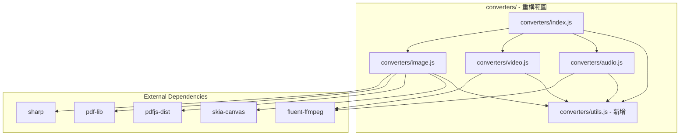

# Design Document: File Converter Refactor

## Overview

重構 Uniconvert 應用程式的檔案轉換模組（後端），改善程式碼結構、錯誤處理和可維護性。主要目標是修復目前損壞的轉換功能，並建立統一的錯誤處理和結果回報機制。

**注意：此重構僅涉及 `converters/` 目錄下的後端模組，不修改前端 GUI。**

## Architecture



## Components and Interfaces

### 1. Utils Module (新增)

提供共用的工具函式，包括依賴檢查、檔案驗證和結果格式化。

```javascript
// converters/utils.js

/**
 * 檢查依賴是否可用
 * @param {string} name - 依賴名稱
 * @returns {{ available: boolean, module: any, error: string | null }}
 */
function checkDependency(name) {}

/**
 * 驗證檔案是否存在
 * @param {string} filePath - 檔案路徑
 * @returns {Promise<boolean>}
 */
async function fileExists(filePath) {}

/**
 * 確保目錄存在，不存在則建立
 * @param {string} dirPath - 目錄路徑
 * @returns {Promise<void>}
 */
async function ensureDir(dirPath) {}

/**
 * 生成不重複的輸出檔名
 * @param {string} dir - 輸出目錄
 * @param {string} baseName - 基礎檔名
 * @param {string} ext - 副檔名
 * @returns {string}
 */
function getUniqueFilename(dir, baseName, ext) {}

/**
 * 建立標準化的結果物件
 * @param {number} ok - 成功數量
 * @param {number} fail - 失敗數量
 * @param {Array<{file: string, error: string}>} errors - 錯誤詳情
 * @returns {{ ok: number, fail: number, errors: Array }}
 */
function createResult(ok, fail, errors = []) {}
```

### 2. Image Converter

處理圖片格式轉換和 PDF 相關操作。

```javascript
// converters/image.js

/**
 * 批量轉換圖片格式
 * @param {string[]} files - 輸入檔案路徑陣列
 * @param {'png' | 'jpg'} format - 目標格式
 * @param {string | null} outputDir - 輸出目錄
 * @returns {Promise<{ ok: number, fail: number, errors: Array }>}
 */
async function batchConvert(files, format, outputDir) {}

/**
 * 合併多張圖片為 PDF
 * @param {string[]} files - 輸入檔案路徑陣列
 * @param {string} outputFile - 輸出 PDF 路徑
 * @returns {Promise<{ ok: number, fail: number, errors: Array }>}
 */
async function mergeImagesToPDF(files, outputFile) {}

/**
 * 將 PDF 每頁轉換為圖片
 * @param {string[]} files - 輸入 PDF 檔案路徑陣列
 * @param {'png' | 'jpg'} format - 目標格式
 * @param {string | null} outputDir - 輸出目錄
 * @returns {Promise<{ ok: number, fail: number, errors: Array }>}
 */
async function pdfEachPageToImage(files, format, outputDir) {}
```

### 3. Video Converter

處理影片格式轉換和音訊提取。

```javascript
// converters/video.js

/**
 * 批量轉換影片格式
 * @param {string[]} files - 輸入檔案路徑陣列
 * @param {'mp4' | 'mov'} targetExt - 目標格式
 * @param {string | null} outputDir - 輸出目錄
 * @returns {Promise<{ ok: number, fail: number, errors: Array }>}
 */
async function batchConvertVideo(files, targetExt, outputDir) {}

/**
 * 從影片提取音訊為 MP3
 * @param {string[]} files - 輸入檔案路徑陣列
 * @param {string | null} outputDir - 輸出目錄
 * @returns {Promise<{ ok: number, fail: number, errors: Array }>}
 */
async function extractAudioMp3(files, outputDir) {}
```

### 4. Audio Converter

處理音訊格式轉換。

```javascript
// converters/audio.js

/**
 * 批量轉換音訊格式
 * @param {string[]} files - 輸入檔案路徑陣列
 * @param {'mp3' | 'wav' | 'm4a'} targetExt - 目標格式
 * @param {string | null} outputDir - 輸出目錄
 * @returns {Promise<{ ok: number, fail: number, errors: Array }>}
 */
async function batchConvertAudio(files, targetExt, outputDir) {}
```

### 5. Index Module

統一的入口點，處理動作分發。

```javascript
// converters/index.js

/**
 * 處理轉換動作
 * @param {string} action - 動作名稱
 * @param {string[]} files - 輸入檔案路徑陣列
 * @param {string | null} outputDir - 輸出目錄
 * @returns {Promise<{ ok: number, fail: number, errors: Array }>}
 */
async function processAction(action, files, outputDir) {}
```

## Data Models

### ConversionResult

```typescript
interface ConversionResult {
  ok: number;      // 成功轉換的檔案數量
  fail: number;    // 失敗的檔案數量
  errors: Array<{  // 錯誤詳情
    file: string;  // 檔案路徑
    error: string; // 錯誤訊息
  }>;
}
```

### DependencyStatus

```typescript
interface DependencyStatus {
  available: boolean;  // 依賴是否可用
  module: any;         // 載入的模組（如果可用）
  error: string | null; // 錯誤訊息（如果不可用）
}
```

## Correctness Properties

*A property is a characteristic or behavior that should hold true across all valid executions of a system-essentially, a formal statement about what the system should do. Properties serve as the bridge between human-readable specifications and machine-verifiable correctness guarantees.*

### Property 1: 結果格式一致性

*For any* 轉換操作，回傳的結果物件必須包含 `ok`、`fail` 和 `errors` 欄位，且 `ok + fail` 等於輸入檔案數量（合併操作除外）。

**Validates: Requirements 7.1, 7.3**

### Property 2: 檔案存在驗證

*For any* 不存在的輸入檔案，轉換器必須將其計入失敗數量並在 errors 陣列中記錄錯誤原因。

**Validates: Requirements 1.4**

### Property 3: 輸出目錄處理

*For any* 轉換操作，如果指定了輸出目錄，輸出檔案必須儲存在該目錄；如果未指定，輸出檔案必須儲存在原始檔案所在目錄。

**Validates: Requirements 6.1, 6.2**

### Property 4: 圖片格式轉換

*For any* 支援格式的圖片檔案，批量轉換後的輸出檔案必須是有效的目標格式（PNG 或 JPG）。

**Validates: Requirements 2.1, 2.2, 2.4**

### Property 5: PDF 頁面轉換

*For any* 有效的 PDF 檔案，轉換後產生的圖片數量必須等於 PDF 的頁數。

**Validates: Requirements 3.1, 3.2**

### Property 6: 錯誤捕獲

*For any* 轉換過程中發生的錯誤，必須被捕獲並記錄在結果的 errors 陣列中，不應導致程式崩潰。

**Validates: Requirements 1.3, 7.2**

### Property 7: 依賴不可用處理

*For any* 依賴不可用的情況，轉換器必須回傳包含描述性錯誤訊息的結果，而非拋出未捕獲的例外。

**Validates: Requirements 1.1, 1.2, 4.5, 5.5**

## Error Handling

### 依賴載入錯誤

- 使用 try-catch 包裝所有依賴載入
- 記錄依賴狀態供後續檢查
- 在轉換前檢查必要依賴是否可用

### 檔案操作錯誤

- 轉換前驗證輸入檔案存在
- 確保輸出目錄存在
- 處理檔案讀寫權限問題

### 轉換過程錯誤

- 每個檔案的轉換獨立處理
- 單一檔案失敗不影響其他檔案
- 收集所有錯誤資訊供回報

### 錯誤訊息格式

```javascript
{
  file: '/path/to/file.jpg',
  error: 'ENOENT: no such file or directory'
}
```

## Testing Strategy

### 單元測試

使用 Jest 進行單元測試：

1. **Utils 模組測試**
   - 測試 `fileExists` 函式
   - 測試 `ensureDir` 函式
   - 測試 `getUniqueFilename` 函式
   - 測試 `createResult` 函式

2. **轉換器測試**
   - 測試各轉換器的錯誤處理
   - 測試結果格式正確性

### Property-Based Testing

使用 fast-check 進行屬性測試：

1. **結果格式一致性測試**
   - 生成隨機檔案列表
   - 驗證結果格式符合規範

2. **錯誤處理測試**
   - 生成包含無效檔案的列表
   - 驗證錯誤被正確捕獲和記錄

### 整合測試

1. **端對端轉換測試**
   - 使用真實的測試檔案
   - 驗證轉換結果正確

2. **IPC 通訊測試**
   - 測試前端到後端的完整流程
